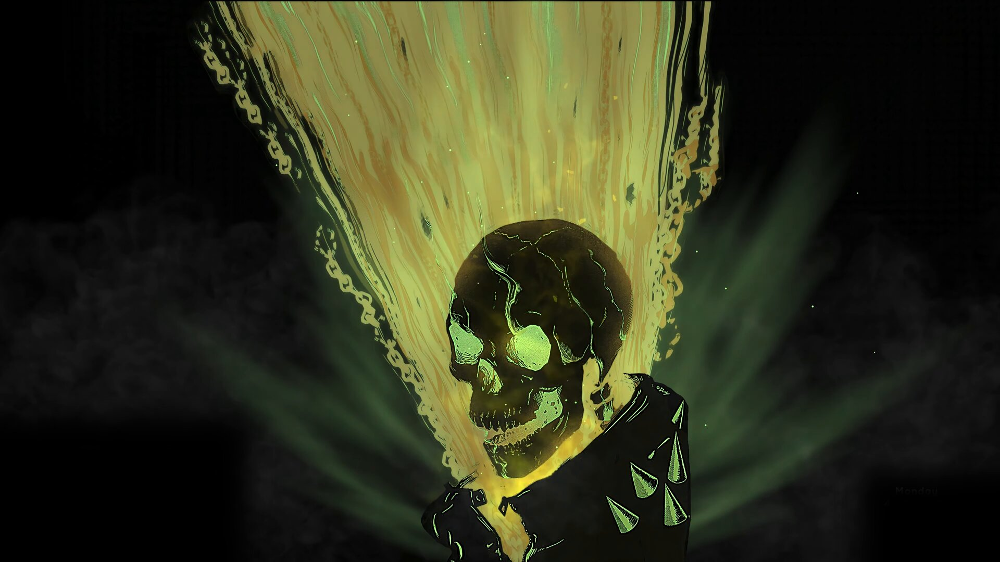

# ⚡ CachyOS Toolbox



**A sleek, modular post-installation setup & optimization suite for CachyOS and KDE Plasma 6.**

Designed for rapid deployment after formatting or setting up a new system. Features an interactive terminal UI (TUI) with checkboxes so you can pick and apply only the tweaks you want in seconds.

---

## 🚀 Quick Start (One-Liner)

Open your terminal and run this single command:

```bash
bash <(curl -sSL https://raw.githubusercontent.com/q0xs/cachyos-toolbox/main/setup.sh)
```

### Manual Installation (Git Clone)

```bash
git clone https://github.com/q0xs/cachyos-toolbox.git
cd cachyos-toolbox
chmod +x setup.sh
./setup.sh
```

---

## 🖥️ Interactive TUI Experience

When launched without arguments, **CachyOS Toolbox** presents an intuitive interactive checklist dialog:

```text
┌───────────────────────── ⚡ CachyOS Toolbox ─────────────────────────┐
│                                                                    │
│  Select the components you want to install and configure:           │
│                                                                    │
│   [*] WALLPAPER  Ghost Rider 4K HDR Live Wallpaper + Lock Screen   │
│   [*] KRUNNER    Spotlight-style Alt+Space (Centered, Clean)       │
│   [*] TIMEOUT    Display Sleep Timeout (Set to 20 minutes)         │
│   [ ] CS2        CS2 Gaming Optimizer (GameMode + Gamescope)       │
│                                                                    │
│                 <  OK  >            < Cancel >                     │
└────────────────────────────────────────────────────────────────────┘
```

> **Navigation:** Use `Arrow Keys` to move, `Space` to toggle checkboxes, `Tab` to switch to buttons, and `Enter` to confirm.

---

## 📦 Included Modules

### 1. 🔥 Ghost Rider 4K HDR Live Wallpaper & Lockscreen
- **4K Ultra HD (3840x2160) @ 60 FPS** video wallpaper powered by KDE's Wallpaper Engine plugin (`com.github.catsout.wallpaperEngineKde`).
- **0.6x Atmospheric Speed:** Slower, majestic flame animation.
- **Seamless Infinite Loop:** 20-second continuous crossfade with zero jump cuts.
- **Distraction-Free:** Audio visualizer, clock, and menu overlays completely removed.
- **Matching 4K Lock Screen:** Extracts and applies the highest quality still frame to the KDE screen locker.
- **GitHub Friendly:** Optimized to 88 MB (< 100 MB limit) for instant downloads without Git LFS quotas.

### 2. 🔍 macOS Spotlight-Style Alt+Space (KRunner)
- Centers KRunner in the middle of your screen as a floating search bar.
- Removes the question mark (`helprunner`) and settings button for a minimalist, clean interface.
- Bound to `Alt+Space` for instant access.

### 3. ⏱️ 20-Minute Display Sleep Timeout
- Automatically configures KDE Powerdevil to turn off displays after 20 minutes (1200 seconds) of inactivity on both AC and Battery.

### 4. 🎮 CS2 Competitive Gaming Optimizer
- Installs `gamemode`, `lib32-gamemode`, and `gamescope`.
- Fixes security capabilities for Gamescope to prevent VAC authentication errors.
- Provides optimized Steam launch options for native Wayland and 4:3 stretched (1280x960 / 1440x1080 @ 240Hz).

---

## 🤖 Non-Interactive / CLI Automation Flags

You can also run specific modules directly without the TUI using command-line arguments:

```bash
# Apply everything at once
./setup.sh --all

# Apply only individual modules
./setup.sh --wallpaper
./setup.sh --krunner
./setup.sh --timeout
./setup.sh --cs2
```

---

## 🛠️ Modular Architecture

Adding your own custom scripts or system tweaks is as simple as dropping an executable bash script into `modules/`:

```text
cachyos-toolbox/
├── assets/
│   ├── ghost_rider_clean_loop_06x.mp4  # 4K 60fps 0.6x video loop (88 MB)
│   ├── lockscreen_ghost_rider.png      # 4K lockscreen image (3.6 MB)
│   └── preview.jpg                     # Preview banner (194 KB)
├── modules/
│   ├── wallpaper.sh                    # Live wallpaper & lockscreen module
│   ├── krunner.sh                      # Spotlight Alt+Space module
│   ├── timeout.sh                      # 20-minute screen timeout module
│   └── cs2.sh                          # CS2 gaming optimization module
├── setup.sh                            # Interactive TUI & master controller
├── install.sh                          # Alias forwarding to setup.sh
├── uninstall.sh                        # Revert script
├── LICENSE                             # MIT License
└── README.md                           # Documentation
```

---

## 🗑️ Uninstallation / Revert

To restore default KDE wallpaper and lock screen settings:

```bash
./uninstall.sh
```

---

## 📄 License

This project is licensed under the [MIT License](LICENSE).
